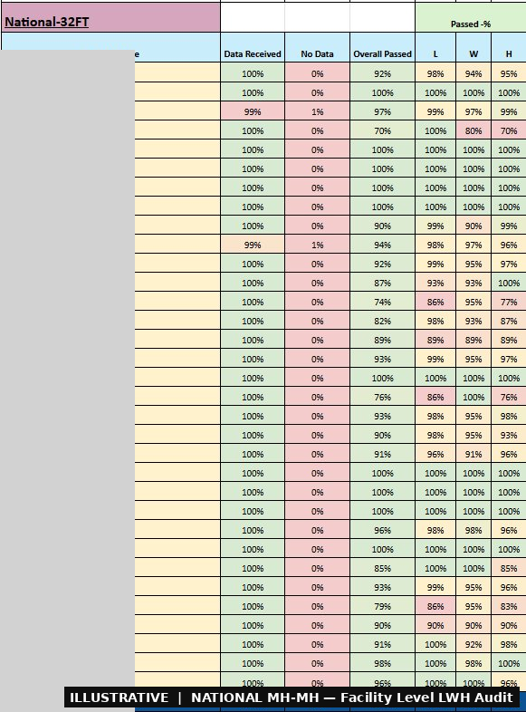
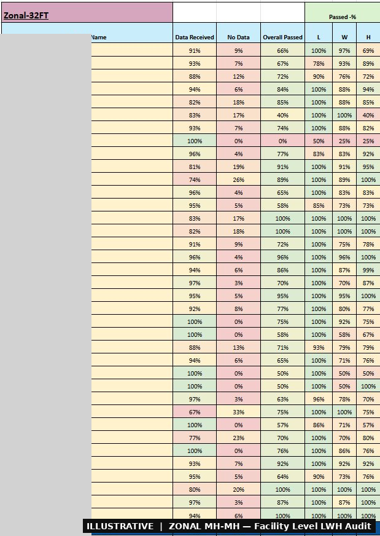
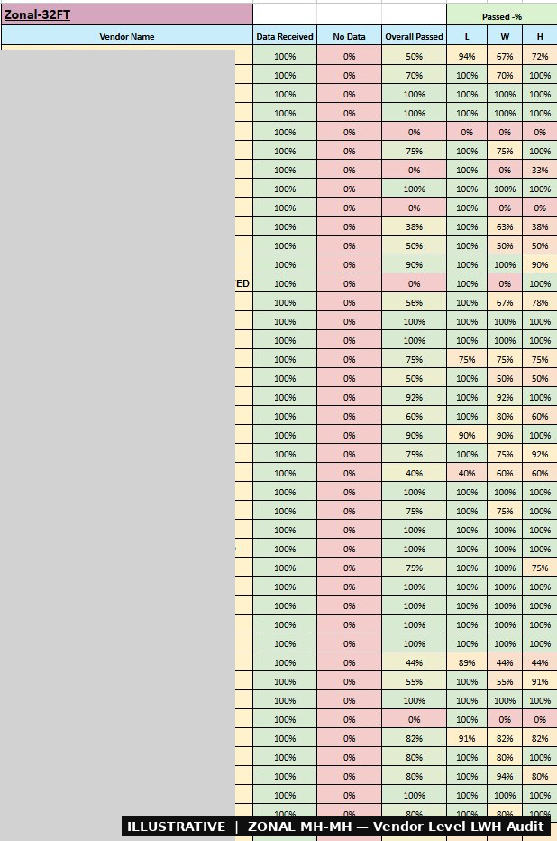
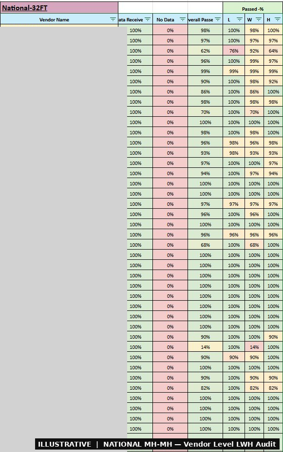

# 🚛 Vehicle LWH Audit & Compliance Pipeline

## Use Case
32FT vehicles not meeting dimension standards were distorting load planning and creating unfair billing — but there was no structured mechanism to identify, report, and penalise non-compliant vendors.

## How It Helped
Built an automated audit pipeline that classifies every vehicle as Pass/Fail per L/W/H dimension, detects High Cube vs Low Cube variants, and produces facility-level and vendor-level compliance reports — feeding the Vendor Scorecard and generating a penalisation dataset for Central Ops & Finance.

## My Role
Designed and owned the full pipeline centrally. Field LWH measurements were executed by Ground Operations & Quality teams at source facilities.

## Views

**National Facility Level** — Per-Motherhub LWH compliance rates for National MH-MH 32FT vehicles with dimension-wise L/W/H breakdown.

**Zonal Facility Level** — Same compliance view for Zonal MH-MH vehicles, showing which hubs have the highest non-compliance rates.

**Zonal Vendor Level** — Transporter-wise compliance rates for Zonal legs — primary input for vendor penalty decisions.

**National Vendor Level** — Transporter compliance rates for National legs feeding directly into the Vendor Scorecard metric.

## Output
4 compliance reports (National & Zonal × Facility & Vendor) with Pass/Fail % per L/W/H. Audit pass rate published on Vendor Scorecard. Penalisation dataset shared with Central Ops & Finance.

---
*Python · Google Colab · Drive API*
